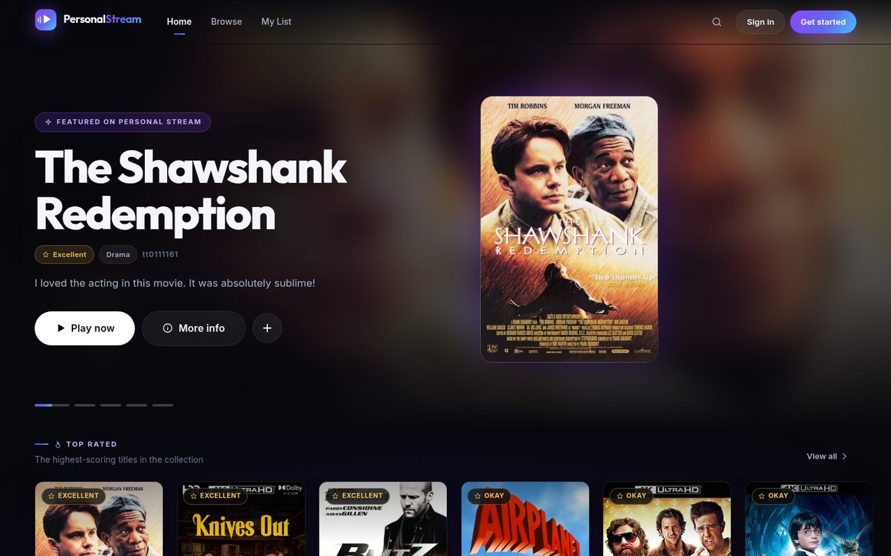
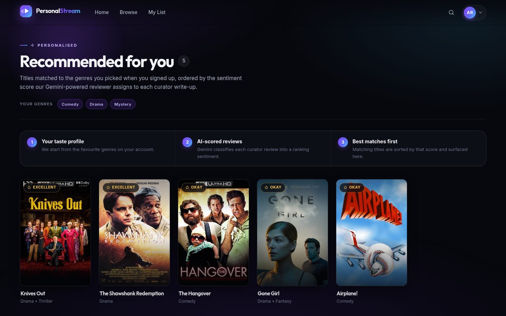
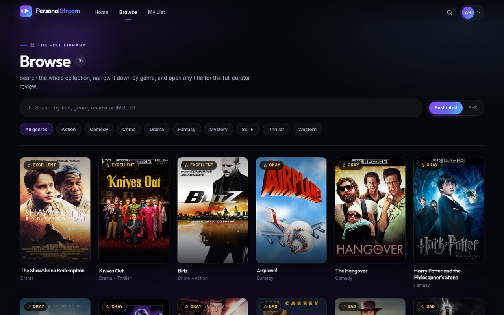
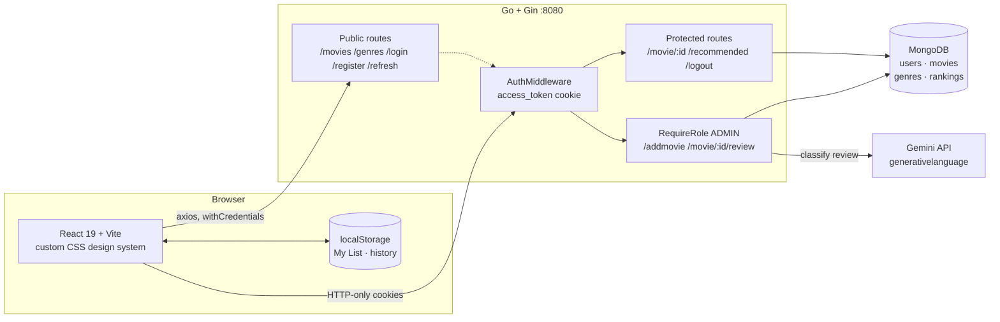
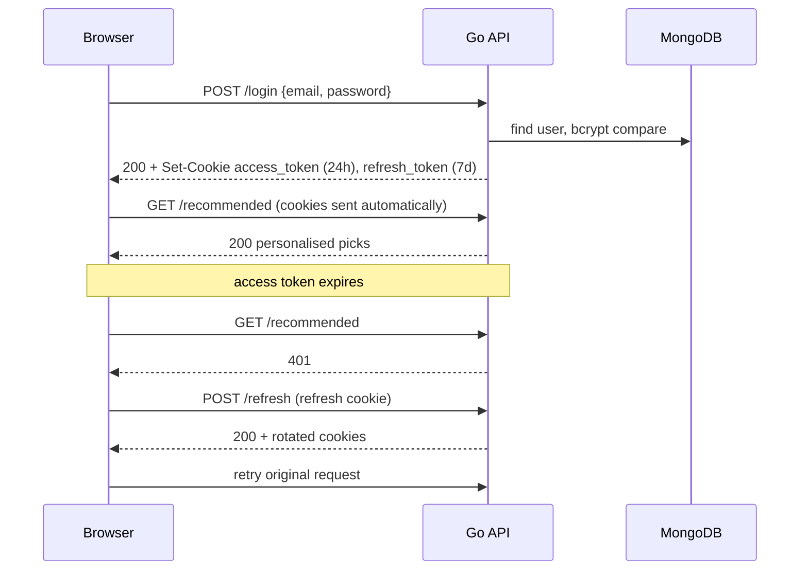
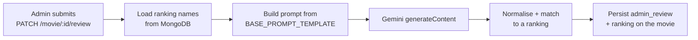

<div align="center">

# 🎬 Personal Stream

**Your own private cinema — a full-stack streaming library with AI-ranked curator reviews.**

Browse a personal movie collection, get picks matched to your favourite genres,
and play any title in one click. Reviews are classified by Gemini into ranking
sentiments that drive the recommendation order.

<br />

[](https://go.dev)
[](https://gin-gonic.com)
[](https://react.dev)
[](https://vite.dev)
[](https://www.mongodb.com)
[](https://ai.google.dev)

<br />



</div>

---

## Table of contents

- [Highlights](#-highlights)
- [Screens](#-screens)
- [Architecture](#-architecture)
- [Tech stack](#-tech-stack)
- [Repository layout](#-repository-layout)
- [Quick start](#-quick-start)
- [Configuration](#-configuration)
- [Seeding MongoDB](#-seeding-mongodb)
- [API reference](#-api-reference)
- [Authentication](#-authentication)
- [Gemini review ranking](#-gemini-review-ranking)
- [Recommendations](#-recommendations)
- [Validation](#-validation)
- [Troubleshooting](#-troubleshooting)
- [Security notes](#-security-notes)
- [Requesting admin access](#-requesting-admin-access)
- [License](#-license)

---

## ✨ Highlights

| | Feature |
|---|---|
| 🎞️ | **Cinematic browsing** — rotating hero spotlight, genre carousels, and a poster grid with hover previews |
| 🔍 | **Instant search & filters** — search titles, genres, reviews or IMDb IDs; filter by genre and sort, all reflected in the URL |
| ✨ | **Personalised picks** — `/recommended` matches your favourite genres and orders by AI-scored review sentiment |
| 🔖 | **My List & Continue Watching** — bookmarks and watch history kept client-side, no extra backend needed |
| ▶️ | **One-click playback** — YouTube embed with a "More like this" row built from shared genres |
| 🔐 | **Cookie-based JWT auth** — HTTP-only access and refresh cookies with transparent refresh on 401 |
| 🤖 | **Gemini review ranking** — admins write a review, Gemini classifies it into a ranking sentiment stored on the movie |
| 🛡️ | **Server-controlled roles** — public registration always creates a `USER`; admin routes are middleware-guarded |
| 📱 | **Responsive & accessible** — works from 390 px up, keyboard-navigable, honours `prefers-reduced-motion` |

---

## 📸 Screens

<table>
<tr>
<td width="50%">

**Recommended** — personalised picks with an explainer of how the AI ranking is produced.



</td>
<td width="50%">

**Browse** — the full library with live search, genre pills and sorting.



</td>
</tr>
</table>

### Routes

| Route | Auth | What it does |
|---|---|---|
| `/` | Public | Hero spotlight plus rows: Continue Watching, Recommended, Top Rated, My List, and one row per genre |
| `/browse` | Public | Whole library with search (`?q=`), genre filter (`?genre=`) and sort (`?sort=`) |
| `/my-list` | Public | Locally saved bookmarks and recently watched |
| `/recommended` | **Required** | Personalised picks from `GET /recommended` |
| `/stream/:yt_id` | **Required** | Player, title metadata, curator review and related titles |
| `/login`, `/register` | Public | Split-screen auth screens |
| `*` | Public | Not-found page |

Clicking a poster opens a detail sheet (review, genres, ranking, IMDb link); the
inline ▶ button skips straight to the player.

---

## 🏗 Architecture



---

## 🧰 Tech stack

<table>
<tr><th align="left">Backend</th><th align="left">Frontend</th></tr>
<tr valign="top"><td>

- Go `1.26.2`
- Gin `1.12`
- MongoDB Go Driver `v2`
- `golang-jwt/jwt/v5` — HS256 access + refresh
- `golang.org/x/crypto` — bcrypt hashing
- `go-playground/validator/v10`
- `google/generative-ai-go` — Gemini SDK
- `joho/godotenv`

</td><td>

- React `19` + React Router `7`
- Vite `8`
- Axios (`withCredentials`)
- **Zero UI framework** — hand-rolled CSS design system with
  design tokens, inline SVG icon set and a custom brand mark
- YouTube iframe playback

</td></tr>
</table>

> [!NOTE]
> Bootstrap and React-Bootstrap were removed during the UI rebuild. All styling now
> lives in `src/index.css` (tokens, buttons, forms, utilities) plus one CSS file per
> component. The whole stylesheet is ~39 kB (~8 kB gzipped).

---

## 📁 Repository layout

```text
.
├── client/                                # React/Vite frontend
│   ├── public/
│   └── src/
│       ├── api/                           # Axios instances (public + credentialed)
│       ├── components/
│       │   ├── auth/                      # Split-screen auth shell
│       │   ├── browse/                    # Search + filter page
│       │   ├── footer/  header/           # App chrome
│       │   ├── hero/    rows/             # Spotlight + carousels
│       │   ├── home/    mylist/           # Home, saved titles
│       │   ├── movie/   movies/           # Poster card, detail sheet, grid
│       │   ├── recommended/               # Personalised picks page
│       │   ├── spinner/ notfound/         # Loaders, skeletons, 404
│       │   ├── stream/                    # Player page
│       │   └── ui/                        # Icon set, brand mark, page header
│       ├── context/                       # Auth + catalogue providers
│       ├── hooks/                         # useAuth, useMovies, useMyList, useRecommended
│       └── utils/                         # YouTube ID + genre helpers
├── server/
│   └── personalStreamMoviesServer/        # Go backend
│       ├── controllers/                   # HTTP handlers (incl. Gemini ranking)
│       ├── database/                      # MongoDB connection helpers
│       ├── middleware/                    # Auth, role guard, CORS
│       ├── models/                        # MongoDB/API models
│       ├── routes/                        # Public and protected route groups
│       └── utils/                         # JWT and context helpers
├── docs/                                  # README screenshots
├── postman/                               # API collections and environments
└── README.md
```

---

## 🚀 Quick start

### Prerequisites

| Requirement | Version | Notes |
|---|---|---|
| Go | `1.26.2`+ | `go version` |
| Node.js | `20`+ | `node --version` |
| MongoDB | Local or Atlas | Connection string required |
| Gemini API key | Optional | Only needed for admin review ranking |

### 1 — Backend

```bash
cd server/personalStreamMoviesServer
cp .env.example .env          # then fill in the values (see Configuration)
go mod download
go run .
```

Verify it is up:

```bash
curl http://localhost:8080/hello     # → Hello, PersonalStream!
curl http://localhost:8080/movies    # → {"data":[...]}
```

### 2 — Frontend

```bash
cd client
cp .env.example .env
npm install
npm run dev
```

Open the URL Vite prints, normally <http://localhost:5173>.

> [!TIP]
> Run the two commands in separate terminals. The frontend expects the API on
> port `8080` and the backend expects the browser on `FRONTEND_ORIGIN` — the two
> must agree or cookies will be rejected.

---

## ⚙️ Configuration

### Backend — `server/personalStreamMoviesServer/.env`

| Variable | Required | Description |
|---|:---:|---|
| `MONGODB_URI` | ✅ | Local URI or Atlas connection string |
| `DATABASE` | ✅ | Database name, e.g. `personal-stream-movies` |
| `FRONTEND_ORIGIN` | ✅ | Exact browser origin for CORS, e.g. `http://localhost:5173` |
| `SECRET_KEY` | ✅ | HMAC secret for access tokens |
| `SECRET_REFRESH_KEY` | ✅ | **Different** HMAC secret for refresh tokens |
| `COOKIE_SECURE` | ✅ | `false` for local HTTP, `true` behind HTTPS |
| `GEMINI_API_KEY` | ⬜ | Server-side only — never expose to the browser |
| `GEMINI_MODEL` | ⬜ | Defaults to `gemini-flash-latest` |
| `BASE_PROMPT_TEMPLATE` | ⬜ | Prompt with a `{rankings}` placeholder |
| `RECOMMENDED_MOVIE_LIMIT` | ⬜ | How many titles `/recommended` returns (default `5`) |

Generate two different secrets locally:

```bash
openssl rand -base64 48   # → SECRET_KEY
openssl rand -base64 48   # → SECRET_REFRESH_KEY
```

Changing either secret invalidates every issued token — users must sign in again.

### Frontend — `client/.env`

| Variable | Description |
|---|---|
| `VITE_API_BASE_URL` | Backend base URL, e.g. `http://localhost:8080` |

> [!CAUTION]
> Anything prefixed with `VITE_` is compiled into the browser bundle and must be
> treated as public. **Never** put `GEMINI_API_KEY`, JWT secrets or database
> credentials in `client/.env`.

---

## 🌱 Seeding MongoDB

The application does not seed itself. Create these four collections in the
database named by `DATABASE`:

| Collection | Purpose |
|---|---|
| `users` | Accounts, hashed passwords, roles, favourite genres |
| `movies` | The catalogue |
| `genres` | Selectable genres shown at registration |
| `rankings` | Sentiment names and their sort values |

<details>
<summary><b>Example documents</b></summary>

**`movies`** — `youtube_id` may be an 11-character ID or a full YouTube URL; the
frontend extracts the ID either way.

```json
{
  "imdb_id": "tt0111161",
  "title": "The Shawshank Redemption",
  "poster_path": "https://image.example/poster.jpg",
  "youtube_id": "PLl99DlL6b4",
  "genre": [{ "genre_id": 2, "genre_name": "Drama" }],
  "admin_review": "",
  "ranking": { "ranking_value": 999, "ranking_name": "Unranked" }
}
```

**`genres`**

```json
{ "genre_id": 1, "genre_name": "Comedy" }
```

**`rankings`** — lower `ranking_value` sorts first. A ranking with value `999` is
treated as the "unranked" sentinel and is excluded from the Gemini prompt.

```json
{ "ranking_value": 1, "ranking_name": "Excellent" }
{ "ranking_value": 2, "ranking_name": "Good" }
{ "ranking_value": 3, "ranking_name": "Okay" }
{ "ranking_value": 4, "ranking_name": "Bad" }
{ "ranking_value": 5, "ranking_name": "Terrible" }
```

</details>

> [!TIP]
> Keep `genre_name` spelling consistent across documents. The UI matches genres
> case-insensitively so `Sci-Fi` and `Sci-fi` collapse into one filter, but
> consistent data keeps the collection tidy.

---

## 🔌 API reference

Base URL in local development: `http://localhost:8080`

### Public

| Method | Path | Response | Description |
|---|---|---|---|
| `GET` | `/hello` | `text` | Health check |
| `GET` | `/movies` | `{ "data": [...] }` | Every movie |
| `GET` | `/genres` | `[...]` | Selectable genres |
| `POST` | `/register` | `201` · `409` if the email exists | Create a `USER` |
| `POST` | `/login` | `200` + sets cookies · `401` | Validate credentials |
| `POST` | `/refresh` | `200` + rotates cookies · `401` | Renew from the refresh cookie |

### Protected — requires a valid `access_token` cookie

| Method | Path | Role | Description |
|---|---|---|---|
| `GET` | `/movie/:imdb_id` | Any | One movie, `{ "data": {...} }` |
| `GET` | `/recommended` | Any | Bare array of personalised picks |
| `POST` | `/logout` | Any | Clears cookies and stored tokens |
| `POST` | `/addmovie` | `ADMIN` | Validate and insert a movie |
| `PATCH` | `/movie/:imdb_id/review` | `ADMIN` | Save a review and classify it with Gemini |

<details>
<summary><b>Request examples</b></summary>

**Register**

```json
{
  "first_name": "Craig",
  "last_name": "Denton",
  "email": "craig@example.com",
  "password": "Password1!",
  "favourite_genres": [
    { "genre_id": 1, "genre_name": "Comedy" },
    { "genre_id": 2, "genre_name": "Drama" }
  ]
}
```

Rules: names 2–100 characters, valid email, password ≥ 6 characters, at least one
genre. `role` is ignored — public registration always creates a `USER`.

**Login**

```json
{ "email": "craig@example.com", "password": "Password1!" }
```

**Admin review update** — `PATCH /movie/tt0080339/review`

```json
{ "admin_review": "An absolute triumph of comedy — every gag lands." }
```

Response:

```json
{ "ranking_name": "Excellent", "admin_review": "An absolute triumph of comedy — every gag lands." }
```

</details>

---

## 🔐 Authentication



- Access token: **24 hours**. Refresh token: **7 days**. Signed with HS256 using
  two different secrets.
- Both are `HttpOnly` cookies, so page JavaScript cannot read them.
- Axios uses `withCredentials: true`; the CORS middleware echoes the exact
  `FRONTEND_ORIGIN` — a wildcard origin is not permitted alongside credentials.
- `useAxiosPrivate` intercepts a `401`, calls `/refresh` once, queues concurrent
  requests, and replays them. If the refresh fails, the session is cleared.

> [!WARNING]
> The login response body also contains `token` and `refresh_token`, and the
> frontend persists the whole response object to `localStorage` under `user`.
> That means the JWTs are readable by any script on the page, which undercuts the
> HTTP-only cookies. Strip both fields before storing (or have the backend omit
> them from `UserResponse`) if you deploy this publicly.

---

## 🤖 Gemini review ranking

Gemini runs **only on the Go backend**, so the API key never reaches the browser.



The response is lowercased and stripped of punctuation, quotes and markdown before
matching, with a containment fallback for answers like `Sentiment: Excellent`. If
nothing matches, the endpoint returns an error rather than silently writing
`ranking_value: 0`.

**Verified behaviour:**

| Review submitted | Gemini verdict | Stored value |
|---|---|---|
| "An absolute triumph of comedy — every gag lands…" | `Excellent` | `1` |
| "Painfully unfunny, badly paced and a complete waste of time." | `Terrible` | `5` |

> [!IMPORTANT]
> **Model choice matters.** `gemini-2.0-flash` currently returns
> `429 RESOURCE_EXHAUSTED` with `limit: 0` on new free-tier keys — it has no free
> quota. Use `gemini-flash-latest` (the default). List the models your key can
> actually call with:
>
> ```bash
> curl "https://generativelanguage.googleapis.com/v1beta/models?key=$GEMINI_API_KEY"
> ```

Get a key from [Google AI Studio](https://aistudio.google.com/app/apikey). Keep it
in the backend `.env` only, and rotate it if it is ever exposed.

---

## 🎯 Recommendations

`GET /recommended` builds a personalised list server-side:

1. Read the signed-in user's `favourite_genres`.
2. Query `movies` where `genre.genre_name` is `$in` those genres.
3. Sort ascending by `ranking.ranking_value` — the score Gemini produced from the
   curator review, so the best-reviewed matches come first.
4. Limit to `RECOMMENDED_MOVIE_LIMIT` (default `5`).

The frontend surfaces this twice: as a **Recommended for you** row on the home
page and as the full `/recommended` page, which also shows your genre chips and
explains how the ranking is derived.

---

## ✅ Validation

**Backend**

```bash
cd server/personalStreamMoviesServer
go build ./...
go vet ./...
go test ./...
```

**Frontend**

```bash
cd client
npm run lint
npm run build
```

**API smoke test**

```bash
curl http://localhost:8080/hello
curl http://localhost:8080/movies
curl http://localhost:8080/genres
```

Postman collections for registration, login, movie retrieval, movie creation and
health checks live under [`postman/`](postman/).

---

## 🩺 Troubleshooting

<details>
<summary><b>The library page says it can't reach the server</b></summary>

Check, in order:

1. The Go backend is running and bound to `:8080` — `curl http://localhost:8080/hello`.
2. MongoDB is reachable and `MONGODB_URI` / `DATABASE` are set.
3. `VITE_API_BASE_URL=http://localhost:8080` exists in `client/.env`.
4. `FRONTEND_ORIGIN` matches the URL in your address bar **exactly**.
5. The browser console shows no CORS error.

If port `8080` is already in use, an older instance is probably still running:

```bash
ss -ltnp | grep :8080
```

</details>

<details>
<summary><b>Registration fails</b></summary>

Password must be at least 6 characters, both names 2–100 characters, at least one
genre selected, and the email must be unused — the API returns `409` for a
duplicate.

</details>

<details>
<summary><b>Login stopped working after editing .env</b></summary>

Changing `SECRET_KEY` or `SECRET_REFRESH_KEY` invalidates every existing token.
Restart the backend and sign in again.

</details>

<details>
<summary><b>Cookies are not being set or sent</b></summary>

For local HTTP development use:

```env
COOKIE_SECURE=false
FRONTEND_ORIGIN=http://localhost:5173
```

Use one hostname consistently — do not browse `127.0.0.1` while CORS is configured
for `localhost`.

</details>

<details>
<summary><b>A title shows "Video unavailable"</b></summary>

The movie's `youtube_id` is missing or malformed. It should be the 11-character
value from a YouTube URL (or a full YouTube URL, which is parsed automatically).

</details>

<details>
<summary><b>The review endpoint returns 500</b></summary>

Most often a Gemini quota or model problem. Check `GEMINI_API_KEY`, confirm
`GEMINI_MODEL` is one your key can call (see the model-listing command above), and
make sure the `rankings` collection is populated — with no rankings there is
nothing for the classifier to choose from.

</details>

---

## 🛡 Security notes

- Never commit `.env` files, JWT secrets, Gemini keys or database credentials.
  The root `.gitignore` already excludes them; `.env.example` files are the safe templates.
- Keep `SECRET_KEY` and `SECRET_REFRESH_KEY` long, random and **different**.
- Use HTTPS with `COOKIE_SECURE=true` in production.
- Never trust a client-supplied `role` — the backend forces public registration to `USER`.
- Never expose Gemini or database credentials through `VITE_` variables.
- Pin `FRONTEND_ORIGIN` to the real deployed origin; wildcards break credentialed CORS.
- See the warning in [Authentication](#-authentication) about JWTs currently being
  mirrored into `localStorage`.

---

## 📮 Requesting admin access

Admin accounts can add titles (`POST /addmovie`) and publish curator reviews
(`PATCH /movie/:imdb_id/review`, which triggers the Gemini ranking). Roles are
assigned server-side and cannot be self-granted.

To request the role, email **<kritansh.11.sss@gmail.com>** with the address your
account is registered under. The same link is available in the site footer.

---

## 📄 License

No license has been defined yet. Add a `LICENSE` file before distributing publicly.
